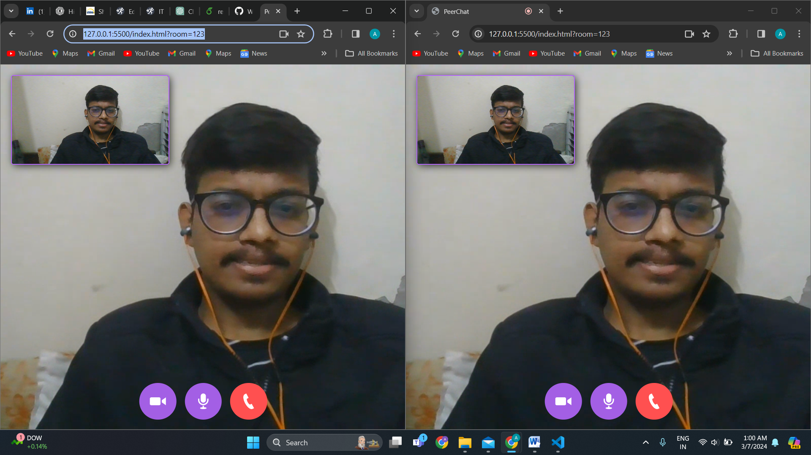

# PeerChat
A peer to peer WebRTC application with controls

# Installation
* 1 - clone repo (https://github.com/Aayussh004/WebRtc-peer2peer-video-conferencing-application)
* 2 - Create an account on agora.io and create an app to generate an APP ID
* 3 - Update APP ID, Temp Token and Channel Name in main.js
* 4 - Deployed Project Link - https://aayussh004.github.io/WebRtc-peer2peer-video-conferencing-application/lobby.html
* Note: Always use same network when connecting a room with same id or both the peers should have same network connection while using this application.
```javascript
let APP_ID = "YOU-APP-ID"
```


  

